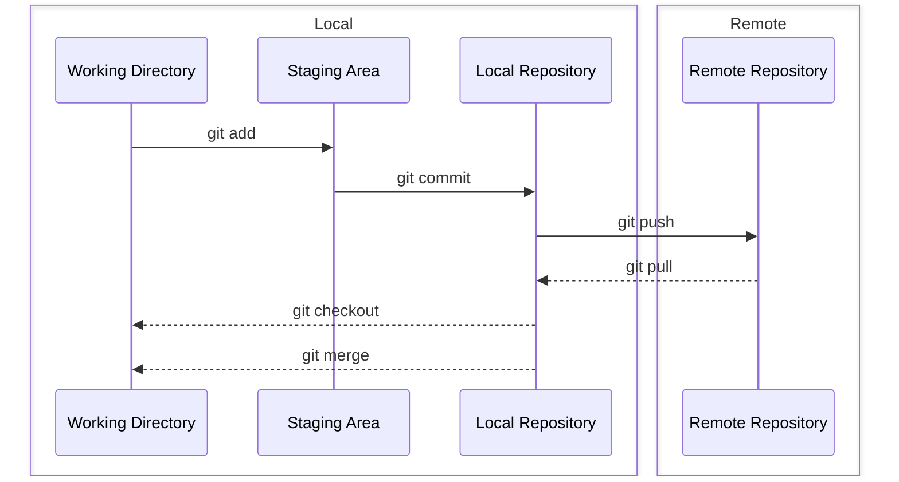

### Adding locally hosted code to GitHub


#### Initiate
```
git init -b main
```

#### Stage
```
git add .
```

#### Commit
```
git commit -m "first commit"
```

### Create Remote Repo
#### Create 
```
gh repo create
```

**Follow CLI instructions**
