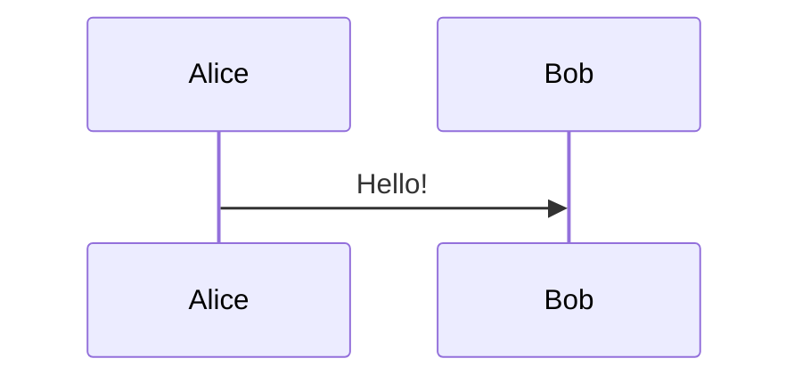

Mermaid diagrams support an optional **init block** at the top of the code fence.  
It lets you configure settings such as fonts, colours, spacing, themes, and diagram-specific behaviour.

---

## What is an init block?

An *init block* appears immediately after the opening ` ```mermaid ` fence:

```
%%{init: { "key": "value" }}%%
diagram content here…
```

It must be the **first line** in the Mermaid code block.

---

## What can it configure?

The init block accepts JSON-style settings. Common uses include:

### 1. Theme variables

Control font size, colours, borders, spacing:

```
%%{init: {
  "themeVariables": {
    "fontSize": "12px",
    "primaryColor": "#e0e7ff",
    "lineColor": "#4b5563"
  }
}}%%
```

### 2. Diagram-specific settings

Each diagram type supports its own config.

Example for sequence diagrams:

```mermaid
%%{init: {
  "sequence": {
    "actorMargin": 60,
    "useMaxWidth": true
  }
}}%%
```

### 3. Global Mermaid options

Control rendering behaviour:

```
%%{init: {
  "startOnLoad": false
}}%%
```

---

## Putting it all together

Example combining multiple settings:



This example:

- Shrinks fonts  
- Allows the diagram to scale to available width  
- Helps diagrams fit inside narrower layouts (e.g., Obsidian)

---

## Tips for Obsidian

- Init blocks work *natively* — no plugin needed.
- They are the easiest way to **shrink diagrams** for Obsidian’s narrow reading column.
- Use `<br/>` inside labels to break long names:

```
participant API as Remote<br/>Repository
```

---

## Troubleshooting

- The init block must be the **first line** after ` ```mermaid `.
- JSON must use **double quotes** and **no trailing commas**.
- If changes don’t apply, temporarily disable custom CSS to rule out conflicts.
