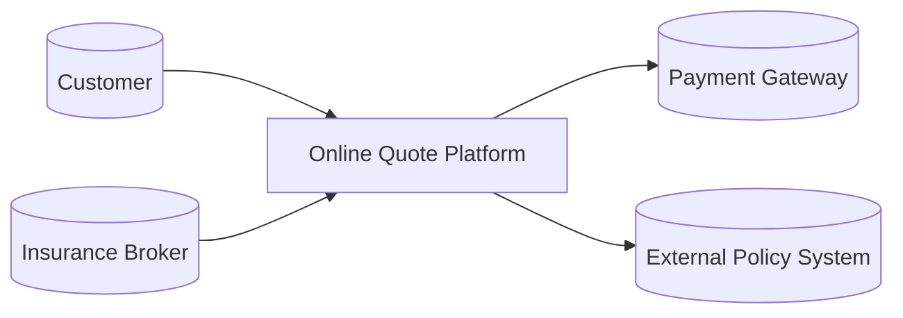
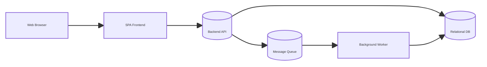
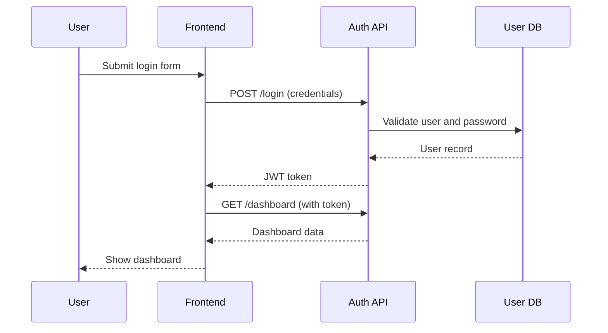
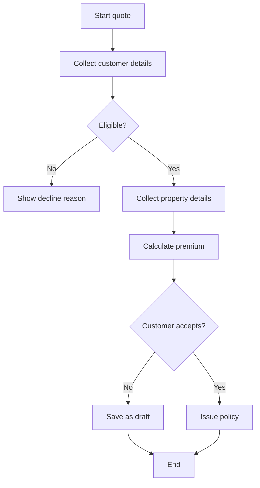
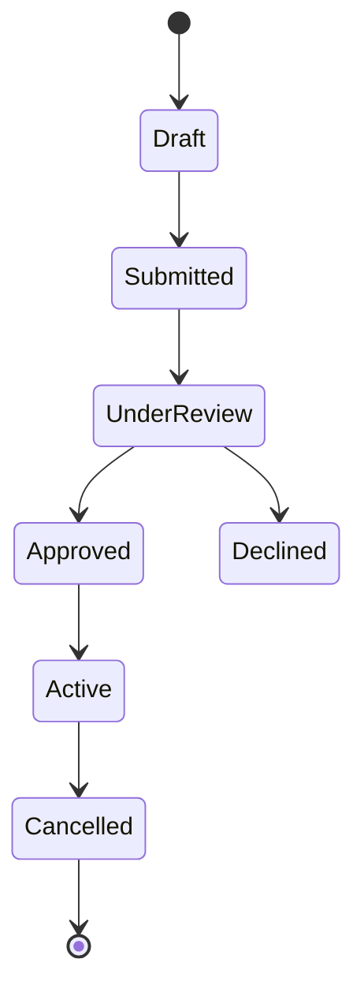
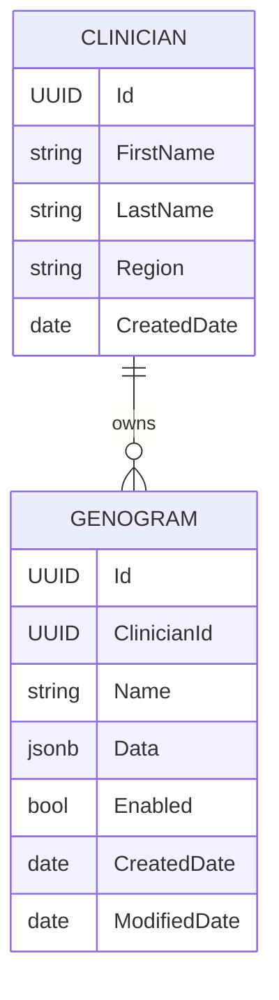
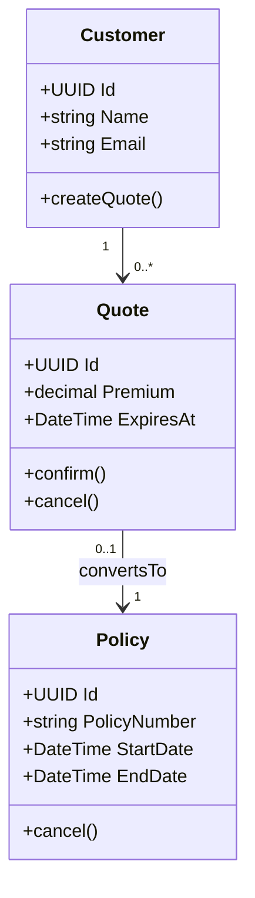
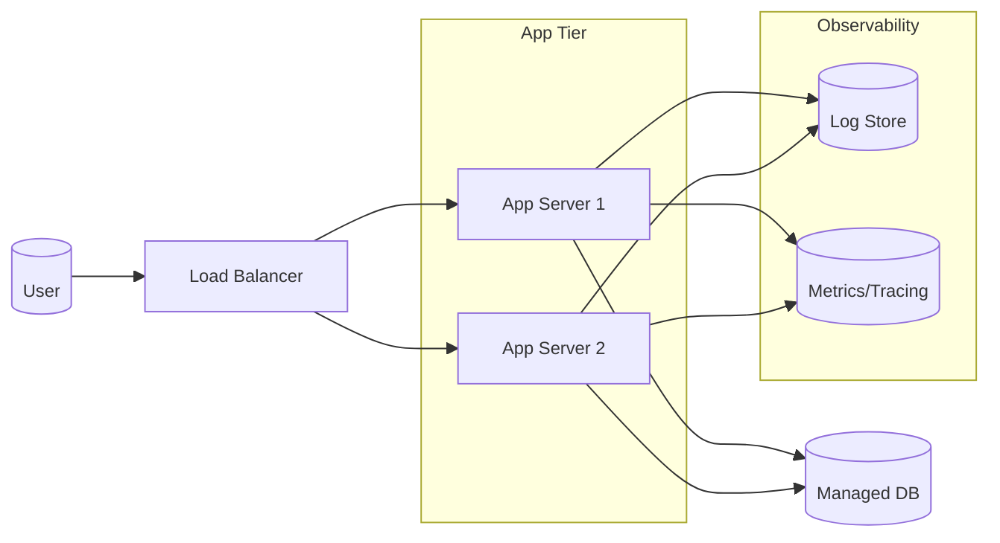
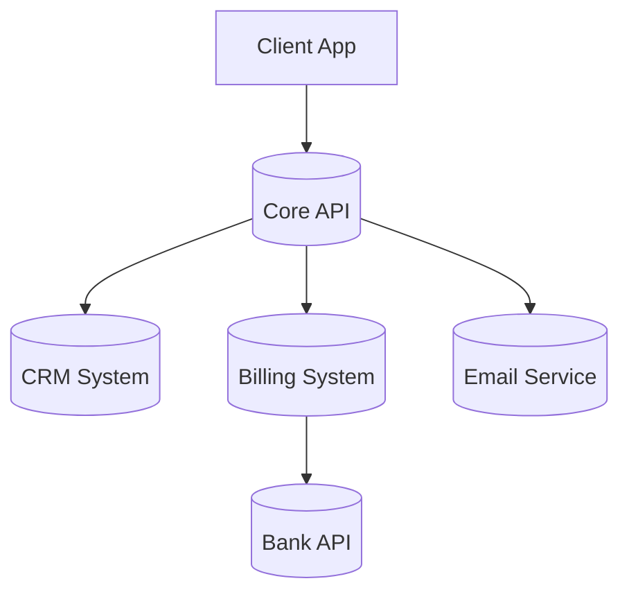

## 1. Big picture diagrams

### 1.1 System Context Diagram (C4 Level 1)

**Goal**  
Show your system as a single box and how it interacts with users and other systems.

**When to use**

- Early in a project or discovery phase  
- Kick-off meetings and architecture reviews  
- Explaining the product to non-technical stakeholders  

**Why to use**

- Aligns everyone on what the system is and is not  
- Clarifies external dependencies and integrations  
- Helps identify trust boundaries and data flows  

**Stakeholders**

- Product managers  
- Business stakeholders  
- Security, compliance, legal  
- Architects and senior engineers  

**Example scenario**

An online insurance quote platform that talks to a payment gateway and an external policy system.

**Mermaid example**

**System design concepts and patterns to think about**

- System boundaries and ownership  
- External dependencies you do not control  
- Trust zones and security boundaries  
- Data protection, PII flows, and audit requirements  

---

### 1.2 Container Diagram (C4 Level 2)

**Goal**  
Show major deployable parts (web app, API, databases, queues) and how they talk to each other.

**When to use**

- Before major refactors or rewrites  
- When introducing microservices or splitting a monolith  
- When discussing deployment and hosting options  

**Why to use**

- Visualises logical and physical separation  
- Helps reason about scalability and resilience  
- Makes it easier to discuss “what runs where”  

**Stakeholders**

- Architects and senior engineers  
- DevOps and platform teams  
- Security and performance engineers  

**Example scenario**

Web frontend, backend API, worker service, database, and message broker.

**Mermaid example**

**System design concepts and patterns to think about**

- Sync vs async communication (HTTP vs queues)  
- Scaling stateless containers vs stateful stores  
- Circuit breakers, retries and backoff  
- Microservices vs modular monolith decisions  

---

## 2. Behaviour diagrams

### 2.1 Sequence Diagram

**Goal**  
Show the order of interactions between components over time.

**When to use**

- Designing or reviewing an API call end-to-end  
- Debugging a complex workflow or bug  
- Clarifying who calls whom and in what order  

**Why to use**

- Makes hidden coupling and chatty calls obvious  
- Helps spot unnecessary round trips  
- Great for latency and reliability discussions  

**Stakeholders**

- Engineers  
- Testers and QA  
- Architects and tech leads  

**Example scenario**

Customer logs in and fetches their dashboard.

**Mermaid example**

**System design concepts and patterns to think about**

- Sync vs async calls  
- Timeouts, retries and error handling  
- Idempotency of operations  
- Transaction boundaries (where you commit)  
- Saga patterns for multi-step workflows  

---

### 2.2 Activity / Flow Diagram

**Goal**  
Show the flow of actions and decisions in a process.

**When to use**

- Business process mapping  
- Designing user journeys and happy path vs edge cases  
- Explaining conditional logic to non-technical stakeholders  

**Why to use**

- Easy to read and explain  
- Generates test cases and acceptance criteria  
- Helps spot dead ends and missing error paths  

**Stakeholders**

- Product and business analysts  
- QA and testers  
- Engineers  

**Example scenario**

High level “get quote” process.

**Mermaid example**

**System design concepts and patterns to think about**

- Happy paths vs exception paths  
- Where to persist intermediate state  
- Idempotent steps and compensation steps  
- Where to place validation and business rules  

---

### 2.3 State Machine Diagram

**Goal**  
Describe how a single entity moves through clearly defined states.

**When to use**

- Orders, policies, tickets, workflows  
- Any entity that can be “Created, Pending, Approved, Rejected, Cancelled”  

**Why to use**

- Makes invalid transitions obvious  
- Prevents “boolean soup” (many flags instead of clear states)  
- Supports robust validation and business rules  

**Stakeholders**

- Architects and engineers  
- Product and operations  
- QA  

**Example scenario**

Policy lifecycle.

**Mermaid example**

**System design concepts and patterns to think about**

- Invariants per state (what must be true)  
- Event sourcing and state changes over time  
- Command and event models  
- Where to enforce transitions (domain layer, workflow engine)  

---

## 3. Structural and data diagrams

### 3.1 Entity–Relationship (ER) Diagram

**Goal**  
Show tables, entities and relationships for your data model.

**When to use**

- Designing or refactoring relational schemas  
- Analysing reporting and analytics requirements  
- Checking impact of new features on data model  

**Why to use**

- Clarifies relationships, cardinality and ownership  
- Prevents duplication and inconsistent data  
- Helps DBAs and engineers discuss indexes and performance  

**Stakeholders**

- Backend engineers  
- DBAs and data engineers  
- Analytics and reporting teams  

**Example scenario**

Clinician and Genogram tables.

**Mermaid example**

**System design concepts and patterns to think about**

- Normalisation vs denormalisation  
- Soft deletes and audit tables  
- Multi-tenancy and row level security  
- Sharding and partitioning for large tables  

---

### 3.2 Class / Domain Model Diagram

**Goal**  
Describe classes or domain objects and how they relate.

**When to use**

- Domain driven design discussions  
- Designing service or module boundaries  
- Explaining where certain logic should live  

**Why to use**

- Encourages encapsulation and rich domain models  
- Prevents anaemic models and god classes  
- Helps map domain language to code  

**Stakeholders**

- Architects and engineers  
- Domain experts (if notation kept simple)  

**Example scenario**

Quote and Policy.

**Mermaid example**

**System design concepts and patterns to think about**

- Aggregates and aggregate roots  
- Value objects vs entities  
- Repositories and application services  
- Tactical patterns (Strategy, Factory, Adapter, Facade)  

---

## 4. Deployment and operations diagrams

### 4.1 Deployment / Infrastructure Diagram

**Goal**  
Show how software is deployed onto infrastructure components.

**When to use**

- Preparing for production rollout  
- Security and threat modelling sessions  
- Capacity planning and performance reviews  

**Why to use**

- Makes single points of failure visible  
- Useful for incident response and runbooks  
- Helps discuss cloud services and cost  

**Stakeholders**

- DevOps and platform engineers  
- Architects  
- Security, operations and SREs  

**Example scenario**

Load balancer, app servers, database, and observability stack.

**Mermaid example**

**System design concepts and patterns to think about**

- Redundancy and failover  
- Horizontal vs vertical scaling  
- Load balancing and sticky sessions  
- Observability (logs, metrics, traces)  

---

## 5. API and integration diagrams

### 5.1 Integration Overview Diagram

**Goal**  
Show external systems and integration flows at a slightly deeper level than the context diagram.

**When to use**

- Planning new integrations or migrations  
- Mapping legacy systems during replacement  
- Explaining responsibilities to partner teams  

**Why to use**

- Visualises where data originates and ends up  
- Highlights potential race conditions and duplication  
- Helps plan strangler-fig patterns around legacy systems  

**Stakeholders**

- Architects and engineers  
- Integration and data teams  
- External partners  

**Mermaid example**

**System design concepts and patterns to think about**

- Anti-corruption layers for legacy systems  
- Event driven integration vs point-to-point  
- Idempotent integration endpoints  
- Versioning and deprecation strategies  

---

## 6. How to think about diagrams during system design

When you are doing system design or architecture work, use diagrams deliberately:

- **Start wide, then go deep**  
  - Context diagram first  
  - Container diagram second  
  - Then pick sequence, ER, state, activity depending on the problem  

- **Match the diagram to the question**
  - “Who talks to us and what do we do for them” → Context  
  - “What lives where and how does it scale” → Container and deployment  
  - “What happens when the user clicks this” → Sequence or activity  
  - “How does this entity change over time” → State  
  - “How is the data structured” → ER or class diagram  

- **Think in patterns while drawing**
  - Caching, CQRS, event sourcing, sagas, pub/sub  
  - Circuit breakers, bulkheads, retries, backpressure  
  - Bounded contexts, aggregate boundaries, ACLs  

- **Keep a layered zoom**
  - Level 1: Context  
  - Level 2: Containers  
  - Level 3: Components / classes  
  - Level 4: Code and configs  

---

## 7. Quick cheat sheet

| Problem or question                                    | Diagram type                     |
|--------------------------------------------------------|----------------------------------|
| Explain system to non-technical stakeholder            | System Context                   |
| Decide how many services and where they run            | Container + Deployment           |
| Understand a complex request end-to-end                | Sequence                         |
| Map out business process and edge cases                | Activity / Flow                  |
| Show how an order or policy moves through states       | State Machine                    |
| Design relational tables and constraints               | ER Diagram                       |
| Discuss domain modelling and entities vs value objects | Class / Domain Model             |
| Plan integrations to external vendors                  | Integration Overview + Sequence  |

If you want, I can reformat this into an Obsidian vault template with frontmatter, headings, tags, and reusable snippets.
